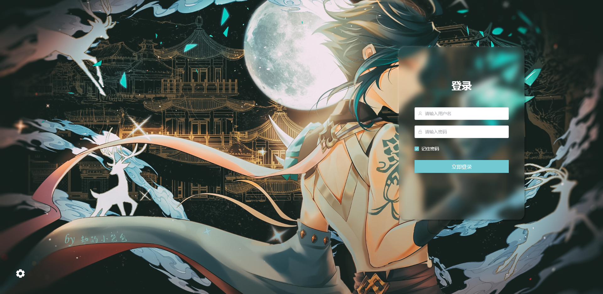
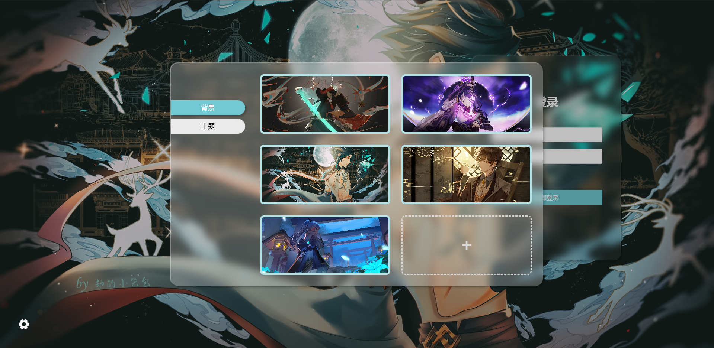
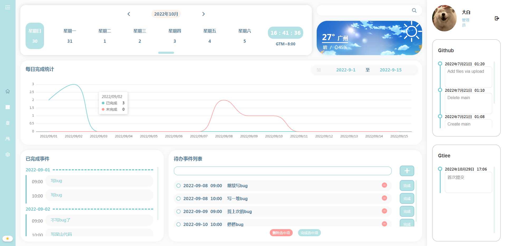
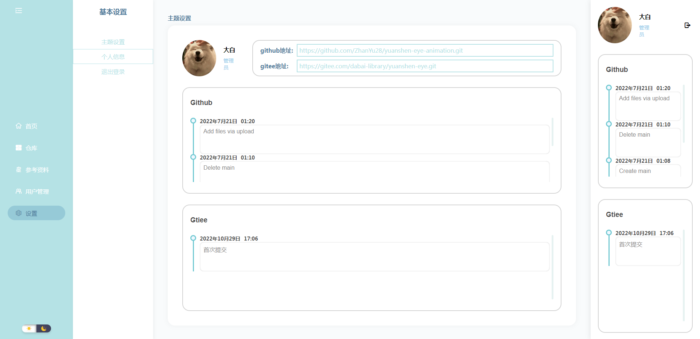
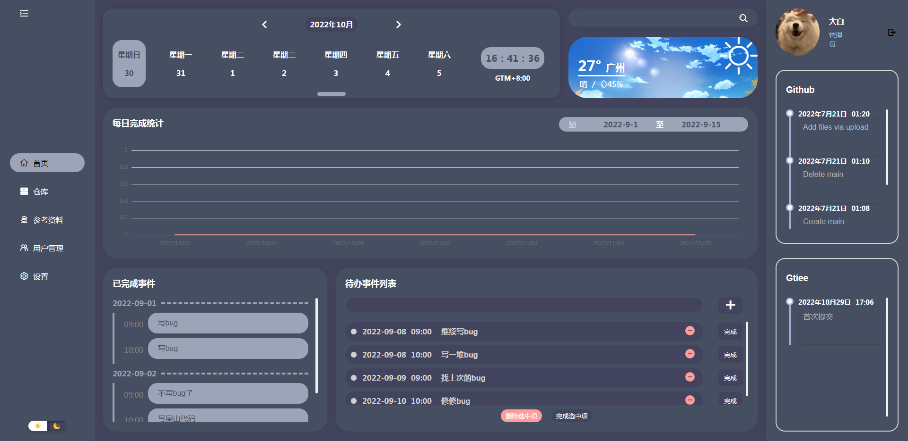
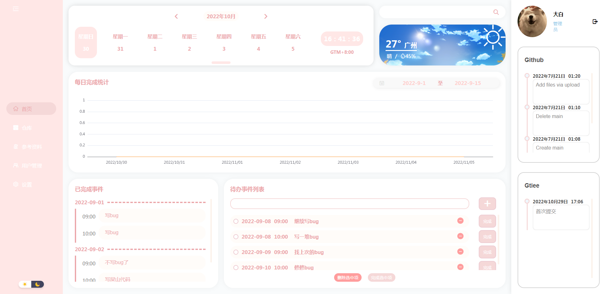

## 简介

该后台管理系统使用了最新的`vue3` `pinia` `Element-Plus` `TypeScript` `echarts`等技术开发，很多东西都是按照自己想法用原生js实现，作者没怎么测试，可能有些许bug，如果大家发现可以留言，互相学习！


## 项目功能

- 登录页面背景可上传图片、自由切换
- 可自由切换整体主题
- 表单验证使用element-plus
- 登录请求数据使用mockjs生成
- 由token存在与否判断当前登录状态
- 导航栏由路由表自动生成
- 选择时间使用鼠标拖动时针分针
- 搜索框可搜索所有包含关键字的事件
- 天气背景根据当前时间自动变化
- 图表根据日期范围、待办，已完成事件，实时更新
- 自定义滚动条组件，隐藏默认滚动条
- 使用pinia状态管理工具存储跨多组件数据
- 项目托管平台地址可以自由更改，更改完成会重新获取数据
- 三个响应断点，可适配多种屏幕尺寸

## 技术点
- Axios二次封装，api的集中管理
- 使用vue3组合式api代替全局事件总线
- 使用多个外部样式动态切换主题
- 滚动条，时间线等多次使用组件的封装
- echarts图表的动态数据展示


## 项目使用

- 获取项目代码

```
git clone https://github.com/ZhanYu28/vue3-management-template.git
```

- 安装依赖

```
npm install

```


- 运行

```
npm run serve
```

- 用户名密码表
```
dabai-----123456 管理员
xiaobai---000000 会员
1---------111111 测试
```

## 项目部分展示

- 登陆页




- 首页



- 设置


- 夜间模式



- 粉色主题




   

   

